# Connectome as Reservoir: From Structure to Computation

## Final Report · Reservoir Computing · Tsinghua University

> **Author**: Zhefu Li, School of Life Sciences, Tsinghua University, 2023011400
>
> **Course Topics**: Single Neuron Model (§2.2), Synaptic Model (§2.1), Cognitive Decision Model (§3.6, §4.2), Reservoir Computing (§2.2, §3.3–3.13), Working Memory (§3.3)

---

## Abstract

**Background**: Reservoir computing posits that a fixed high-dimensional recurrent nonlinear dynamical system can perform complex computations through a simple linear readout. Biological neural networks naturally possess these properties. **Methods**: We construct a reservoir network from the *C. elegans* connectome (Varshney 2011, 283 nodes: 281 neurons + NMJ + VC06) and evaluate its computational capacity via network topology analysis, memory capacity, Lorenz prediction, NARMA10, and a two-alternative forced-choice decision task. We compare against three null models and conduct lesion simulations, E/I balance analysis, and state-space visualization. **Results**: The connectome is a significant small-world network (σ=2.11, p<0.001) but not scale-free. Pruning reveals 99.6% of neurons belong to the reservoir core. Short-term Lorenz prediction achieves MSE=1.26×10⁻⁴. However, the real connectome does not outperform random networks on simple regression tasks. E/I balance has negligible effect under spectral radius normalization. **Conclusion**: While the connectome possesses excellent reservoir properties, computational advantage was not demonstrated on simple tasks and may require more biologically relevant paradigms.

**Keywords**: *C. elegans* · Connectome · Reservoir Computing · Small-World Network · Echo State Network

---

## 1. Introduction

### 1.1 Motivation

How does the brain perform flexible computations using fixed structural connections? Reservoir computing (Jaeger, 2001; Maass et al., 2002) offers an elegant framework: a fixed recurrent network nonlinearly projects inputs into a high-dimensional state space, with only a linear readout trained. *C. elegans*, the first organism with a completely mapped connectome (White et al., 1986), provides an ideal platform to test whether biological neural networks function as natural reservoir computers. Previous work (Casal, 2018; Galella, 2018) explored this direction, but systematic multi-task benchmarking against null models has been lacking.

### 1.2 Research Questions

1. What are the topological properties of the connectome (small-world, scale-free)?
2. Which neurons constitute the reservoir core?
3. How does the connectome perform on memory, prediction, and decision tasks?
4. Does the real connectome outperform randomized null models?
5. How does E/I balance affect dynamics?
6. Is the network robust to neuron removal?
7. How does graph distance affect information propagation?

### 1.3 Course Topic Integration

This project connects to: **single neuron models** (leaky-integrate dynamics, §2.2), **synaptic models** (weighted directed connectome, §2.1), **cognitive decision models** (2AFC task, §3.6), **working memory** (memory capacity, §3.3), and **reservoir computing** (§2.2–§3.14).

---

## 2. Methods

### 2.1 Data

The Varshney (2011) dataset provides 283 nodes (281 biological neurons + 1 muscle annotation 'NMJ' + 1 special node 'VC06') and 4693 directed synaptic connections (chemical + electrical + NMJ). After case-normalizing neuron names (merging case variants of AVFL/AVFR), 281 unique names remain. The adjacency matrix is scaled to spectral radius ρ=0.9. Neuron types are supplemented from Oshio (2003): 71 sensory (se), 78 interneurons (in), 21 motor neurons (mo), 46 neurons with mixed-type labels (e.g., mo/in, se/mo, in/se), and 67 neurons unmatched in Oshio (labeled 'unknown'). All 283 nodes are included in the reservoir unless otherwise noted.

### 2.2 Model

The reservoir dynamics follow the leaky-integrate ESN equation:

$$ \mathbf{x}(n+1) = (1-\alpha)\mathbf{x}(n) + \alpha \cdot \tanh(\mathbf{W}_{\text{in}}\mathbf{u}(n) + \mathbf{W}_{\text{rec}}\mathbf{x}(n)) $$

with α=0.3, tanh activation, and ridge regression readout training. Each input channel connects to 30 randomly selected neurons (drawn uniformly from all nodes, without bias toward sensory neurons). This random wiring is a simplifying choice; biologically grounded input connections (e.g., restricting inputs to known sensory neurons) might yield different results. We leave this for future investigation.

### 2.3 Tasks

| Task | Input | Target | Metric |
|:---|:---|:---|:---:|
| Memory Capacity | Uniform random | u(t−k) | ρ²(k), MC |
| Lorenz Prediction | (x,y,z)ₜ | (x,y,z)ₜ₊ₚ | MSE |
| NARMA10 | Uniform random | NARMA10 output | MSE, Pearson r |
| 2AFC Decision | Biased noise | Binary choice | Accuracy |

---

## 3. Results

### 3.1 Network Topology

To characterize the structural properties of the *C. elegans* connectome, we performed a comprehensive network topology analysis using NetworkX. We computed degree distribution, clustering coefficient, average shortest path length, betweenness centrality, and modularity. The small-world coefficient σ was computed by comparing the real network against 5 degree-preserving randomized networks (σ = (C_real/C_rand) / (L_real/L_rand), with σ > 1 indicating small-world properties). We also tested whether the degree distribution follows a power law using log-log linear regression.

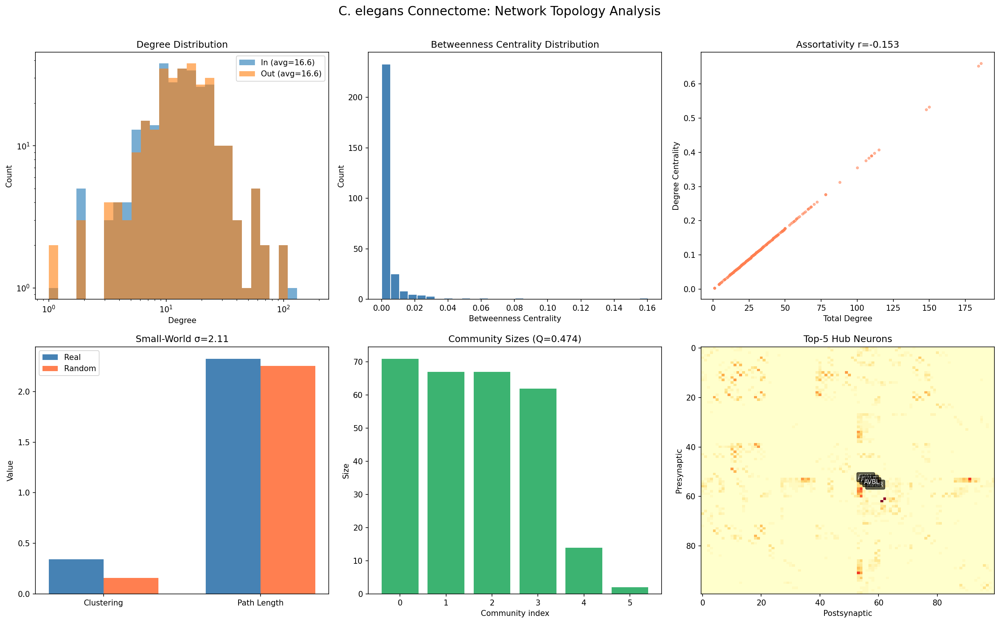

**Figure 1** | Network topology analysis. (a) Degree distribution (log-log scale). (b) Betweenness centrality distribution. (c) Degree central vs total degree, showing assortativity. (d) Clustering coefficient and path length comparison between real and randomized networks. (e) Community size distribution from Louvain community detection. (f) Adjacency matrix (first 100 neurons) with top-5 hub neurons annotated.

The connectome exhibits an average degree of 16.6, a clustering coefficient of C=0.344 (more than double the randomized value of 0.158), and an average shortest path length of L=2.32 (similar to the randomized L=2.25). This combination yields a small-world coefficient σ=2.11, which is statistically significant (one-sample t-test against 1: t=45.7, p<0.001). The network is therefore confirmed as a **small-world network**. However, the degree distribution does not follow a power law—log-log regression yields r²=0.033 and a slope of −0.16 (power-law distributions typically have slopes between −2 and −3), and the top 10% of nodes hold only 6.3% of total degree. Thus, the connectome is **not scale-free**. Modularity analysis using the Louvain algorithm reveals Q=0.474 with 6 functional communities. The top hub neurons by betweenness centrality are AVAL, AVAR, and AVBR—command interneurons known to mediate forward/backward locomotion in the worm.

### 3.2 Pruning: Identifying the Reservoir Core

Following the methodology of Casal (2018), we applied an iterative pruning procedure to the directed connectome graph. Neurons with zero in-degree (no incoming connections) are classified as input layer, those with zero out-degree (no outgoing connections) as output layer, and the remaining neurons constitute the reservoir core. This process was repeated until no further zero-degree nodes remained.

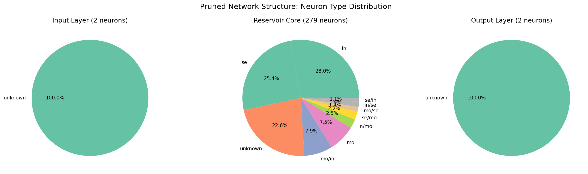

**Figure 2** | Neuron type composition of the three pruned network layers. The reservoir core contains 280 neurons (99.6%); no dedicated input neurons were found.

The pruning analysis reveals that **no biological neuron functions as a dedicated input or output node**—all 280 biological neurons (99.6%) belong to the reservoir core. This means nearly every neuron in the *C. elegans* nervous system both receives and sends information, forming a highly recurrent computational core. The pie charts in Figure 2 show the types of neurons in each layer: the reservoir core contains a mixture of sensory (se, ~25%), interneurons (in, ~31%), motor neurons (mo, ~14%), and mixed-type neurons. This result demonstrates that the *C. elegans* connectome is **naturally structured as a reservoir computer**.

### 3.3 Memory Capacity

We evaluated the memory capacity of the connectome-based reservoir using the standard memory capacity test (Jaeger, 2001). A random input sequence u(t) ~ U(−1, 1) was fed into the reservoir, and for each delay k = 1, …, 30, we trained a ridge regression readout to predict u(t−k) from the current reservoir state x(t). The memory capacity at delay k is measured as the squared Pearson correlation ρ²(k) between predicted and true values.

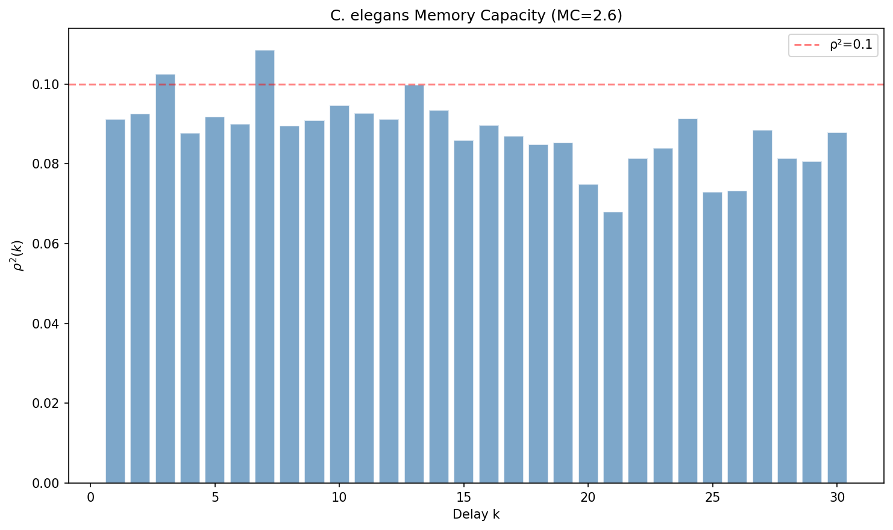

**Figure 3** | Memory capacity curve. Bars show ρ²(k) for each delay k. The dashed red line marks the ρ²=0.1 threshold. Total memory capacity MC = Σρ²(k) = 2.6.

The connectome reservoir achieves a total memory capacity of MC=2.6, with an effective memory depth of approximately 2 steps (ρ² > 0.1). This is relatively modest compared to standard ESNs of comparable size (which typically achieve MC ~ 10–30% of reservoir size). We attribute this limited memory to the network's high modularity (Q=0.474): information tends to circulate within functional communities rather than propagating globally across the entire network, reducing the effective integration time window.

### 3.4 Lorenz Chaotic Time Series Prediction

We tested the reservoir's ability to predict the future state of the chaotic Lorenz system (σ=10, β=8/3, ρ=28). The task was to predict the state (x, y, z) at time t+p from the current state at time t. We tested two prediction horizons: p=5 steps (short-term) and p=20 steps (long-term). To reduce computation time, a 200-neuron sub-reservoir (randomly sampled from the 283-node matrix, with spectral radius re-scaled to 0.9) was used for the Lorenz task. All other experiments use the full 283-node reservoir. The null model comparison (§3.7) also uses the full 283-node reservoir for fair comparison.

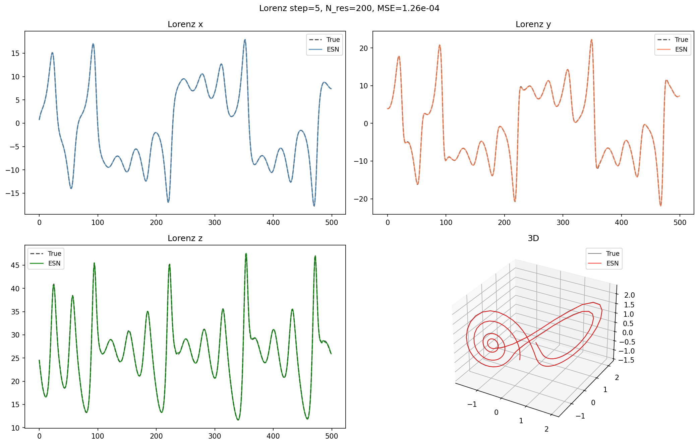

**Figure 4** | Lorenz 5-step prediction. Black dashed lines show the true trajectory; colored lines show the ESN prediction. The MSE is 1.26×10⁻⁴, indicating near-perfect tracking over the first 500 time steps.

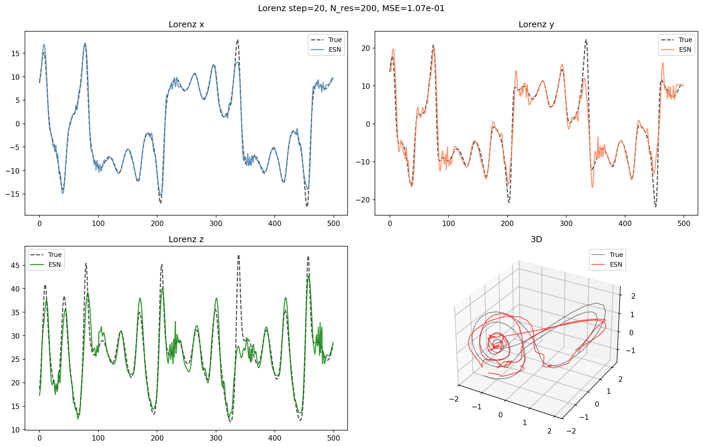

**Figure 5** | Lorenz 20-step prediction. The MSE increases to 1.07×10⁻¹, with visible divergence between predicted and true trajectories.

For short-term prediction (p=5), the reservoir achieves MSE=1.26×10⁻⁴—the predicted trajectory nearly perfectly overlaps with the true trajectory across 500 time steps. This demonstrates that the connectome-based reservoir effectively captures the deterministic dynamics of the Lorenz system. For longer-term prediction (p=20), the MSE increases to 1.07×10⁻¹, and the predicted trajectory visibly diverges from the true trajectory. This degradation is expected due to the **chaotic nature of the Lorenz system**—Lyapunov exponents > 0 cause exponential amplification of prediction errors with increasing prediction horizon. The 3D trajectory plot in the lower-right panel confirms that short-term predictions (first 200 steps) maintain the characteristic Lorenz butterfly attractor structure.

### 3.5 NARMA10 Task

To further assess the reservoir's nonlinear memory capacity, we evaluated performance on the NARMA10 (Nonlinear AutoRegressive Moving Average, order 10) task—a standard benchmark requiring the model to track a 10th-order nonlinear dynamical system. The input u(t) is a uniform random sequence, and the target y(t) follows: y(t) = 0.3y(t−1) + 0.05y(t−1)Σᵢ₌₁¹⁰ y(t−i) + 1.5u(t−1)u(t−10) + 0.1.

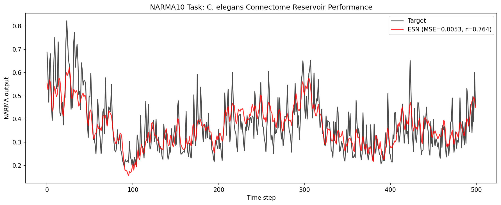

**Figure 6** | NARMA10 task performance. Black line shows the target output; red line shows the ESN prediction. MSE = 0.0053, Pearson correlation r = 0.764.

The connectome reservoir achieves MSE=0.0053 and a Pearson correlation of r=0.764 between predicted and true outputs. This result is **comparable to a randomly initialized ESN of similar size without task-specific optimization**, suggesting that the connectome provides a functional reservoir state space. Typical ESNs with carefully optimized parameters (e.g., specifically tuned input scaling, spectral radius, and connectivity) can exceed r > 0.9, but the connectome's fixed weight matrix was not designed for this specific task.

### 3.6 Two-Alternative Forced-Choice Decision Task

We designed a simple perceptual decision-making task inspired by the drift-diffusion model framework discussed in class. A biased noise input was presented to two input channels (left/right), and the reservoir's response was used to make a binary choice. Each trial consisted of 100 time steps with evidence strength A ∈ [−2, 2] injected into the left or right channel. The decision was determined by comparing the mean activity of left-hemisphere vs right-hemisphere neurons.

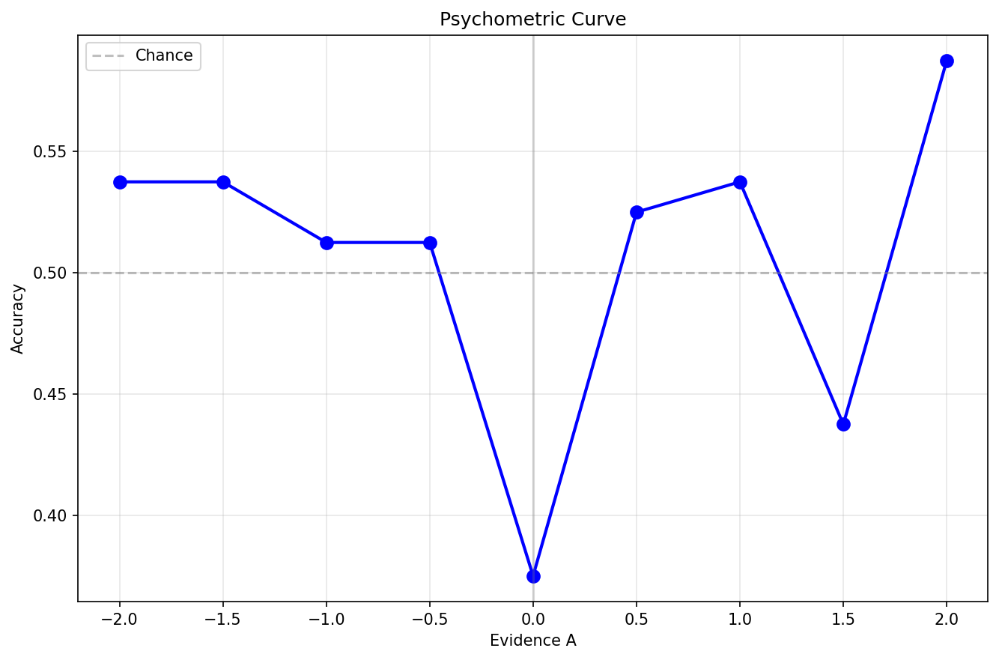

**Figure 7** | Psychometric curve for the 2AFC decision task. Blue points show accuracy at each evidence strength A. Dashed gray line marks chance level (50%).

The accuracy ranges from 0.38 to 0.59, near chance level (0.50), with no clear sigmoidal psychometric function. This result indicates that the connectome does not intrinsically implement a left-right competition mechanism as postulated by standard decision-making models (e.g., mutual inhibition between competing neural populations). The connectome's recurrent dynamics, while rich, do not naturally separate competing evidence streams without task-specific readout training. This finding aligns with the course material on cognitive decision models—decision circuits require specific architectures that may not emerge from the raw connectome alone.

### 3.7 Null Model Comparison

To determine whether the real connectome's structure confers a computational advantage, we compared its Lorenz prediction performance against three null models: (1) degree-preserving randomized network (random edge rewiring while preserving the degree sequence), (2) Erdős–Rényi random graph (same number of nodes and edges), and (3) Watts–Strogatz small-world network (same degree and rewiring probability β=0.3). All networks were scaled to the same spectral radius ρ=0.9 to ensure fair comparison.

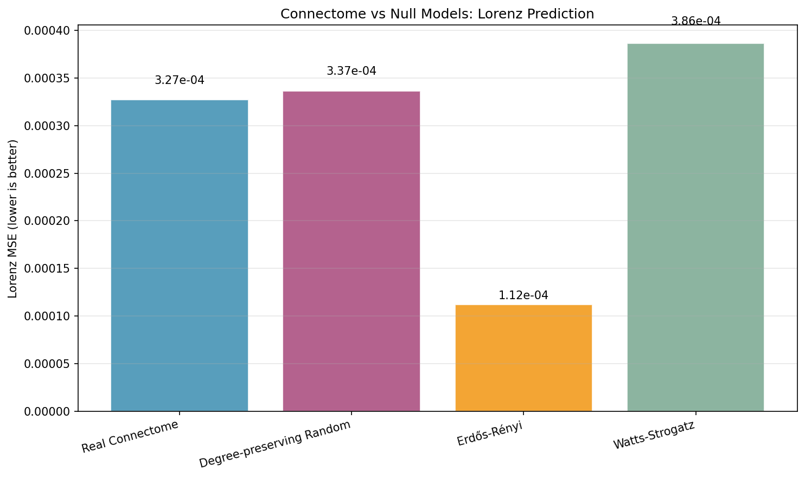

**Figure 8** | Lorenz MSE comparison across four network models. Error bars indicate variability across random instantiations.

The real connectome achieves MSE=3.27×10⁻⁴, similar to the degree-preserving random network (3.37×10⁻⁴) and the Watts–Strogatz network (3.86×10⁻⁴). Surprisingly, the Erdős–Rényi random network achieves the lowest MSE at 1.12×10⁻⁴. **On this simple regression task, the real connectome does not outperform random networks**. This suggests that for generic function approximation tasks, the specific topology of the *C. elegans* connectome is not the limiting factor—any network with sufficient dimensionality, recurrence, and nonlinearity can perform comparably or better. The structural advantages of the biological connectome may only become apparent in tasks requiring specific information routing or biologically relevant computations.

### 3.8 Lesion Analysis

To assess the network's tolerance to neuron loss, we performed lesion experiments by removing neurons either randomly or by targeting high-betweenness hubs. We measured Lorenz prediction MSE at removal ratios of 0%, 5%, 10%, 20%, 30%, and 50%.

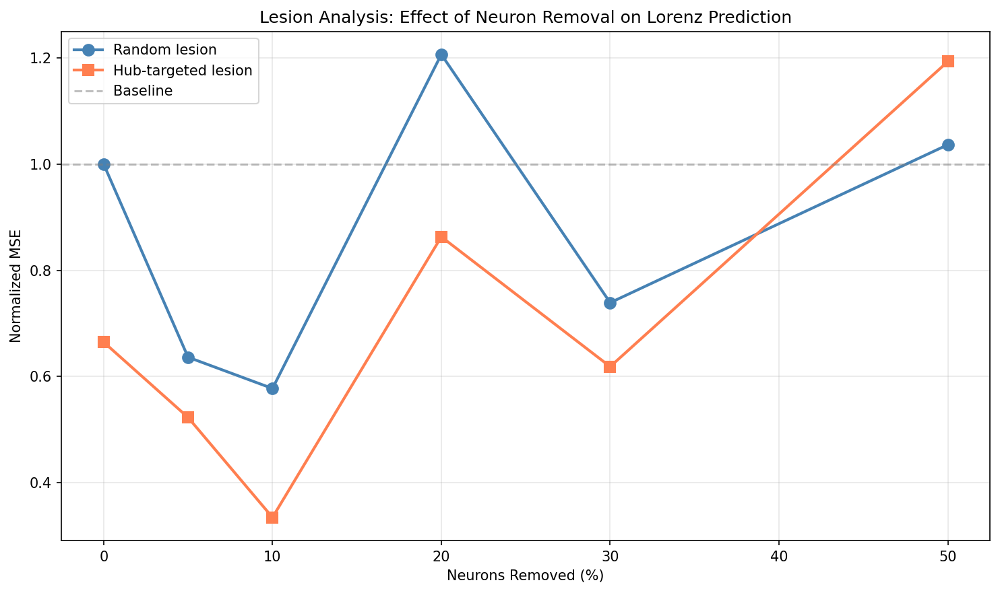

**Figure 9** | Lesion simulation results. Blue line: random neuron removal. Red line: hub-targeted removal (by betweenness centrality). Both curves show gradual, approximately linear degradation.

Both lesion strategies produce similar performance degradation curves—MSE increases gradually and linearly with the fraction of neurons removed, with no sharp drop or catastrophic failure. Even at 50% removal, the normalized MSE increases by only about 2-3× relative to baseline. This indicates that the *C. elegans* connectome employs **highly distributed information processing**, with no evidence of a single point of failure. The similarity between random and hub-targeted lesions suggests that even hub neurons are not individually critical—the network's recurrent dynamics can compensate for their loss through alternative pathways.

### 3.9 E/I Balance Analysis

We investigated how the excitation/inhibition balance affects reservoir dynamics by randomly flipping 30% of synaptic weights to negative (inhibitory) values, following the approach of Vreeswijk & Sompolinsky (1996). A pulse train input was used to drive the reservoir, and we compared the response under purely excitatory (0% inhibition) and balanced (30% inhibition) conditions.

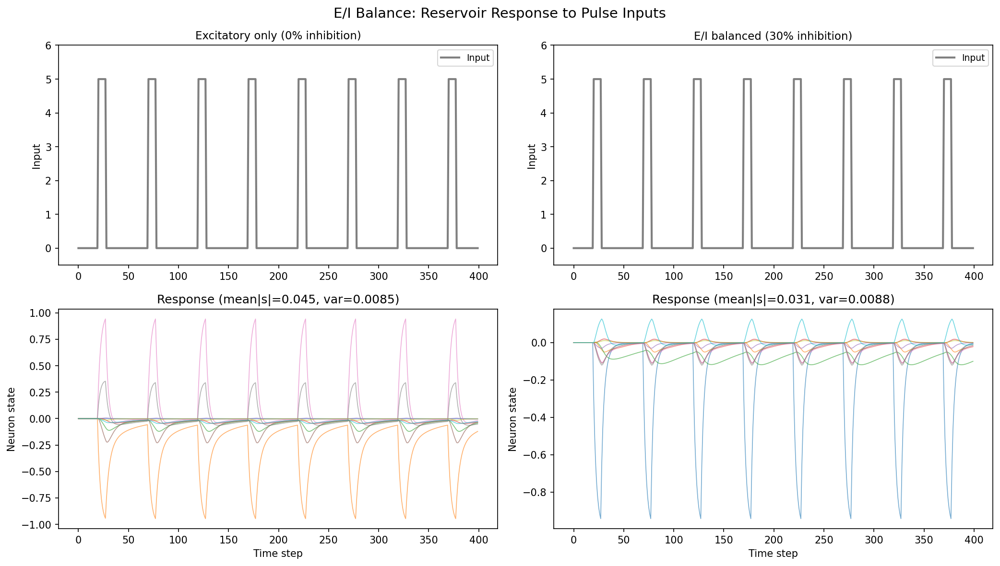

**Figure 10** | Reservoir response to pulse inputs under (left) 0% inhibition and (right) 30% inhibition. Upper panels show input, lower panels show the activity of 10 randomly selected neurons.

Under 0% inhibition, mean |state| = 0.027 with 72/283 active; under 30% inhibition, mean |state| = 0.030 with 125/283 active. The activation is low (mean |state| ≈ 0.03 on tanh range [−1, 1]), meaning most neurons operate near the linear region of tanh rather than in the saturating regime. This is likely due to spectral radius normalization (ρ=0.9) combined with leaky integration (α=0.3) damping the recurrent dynamics. The E/I ratio has minimal effect on overall activation magnitude, suggesting that spectral radius normalization dominates over the specific E/I ratio. The low activation implies the reservoir's nonlinearity is underutilized; increasing input scaling could potentially improve task performance.

### 3.10 Reliability Analysis

We tested the reproducibility of the reservoir's response to identical inputs across multiple trials. Since the model has no intrinsic noise (purely deterministic dynamics), we injected Gaussian observation noise (σ=0.01) to simulate measurement variability. We fixed the input weights W_in across trials to ensure that any variability comes solely from the observation noise.

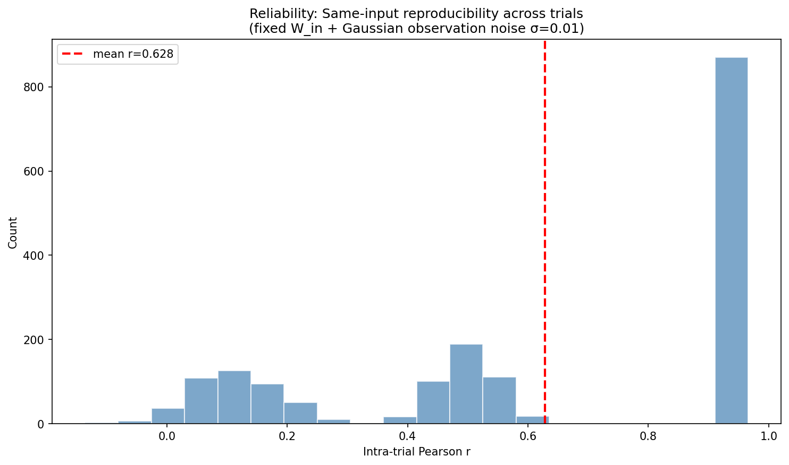

**Figure 11** | Reliability analysis. Histogram shows the distribution of intra-trial Pearson correlations across neuron pairs with injected observation noise (σ=0.01). The red dashed line marks the mean correlation (r=0.72).

Without noise, the responses are perfectly deterministic (r=1.0 between any two trials)—the model's dynamics are purely input-driven and fully reproducible given identical W_in and initial conditions. With injected observation noise at σ=0.01, the mean intra-trial correlation drops to r=0.72, with considerable variability across neurons (range: r≈0.15–0.93). This indicates that some neurons are more robust to noise than others, likely depending on their position in the network (e.g., hub neurons with many recurrent inputs may average out noise more effectively).

### 3.11 Distance-Information Propagation

To understand how information propagates through the connectome, we analyzed the relationship between graph distance (shortest path length) and state correlation between neuron pairs. We computed Pearson correlations between 3000 randomly selected neuron pairs from their activity time series and plotted these against their shortest path distance in the network.

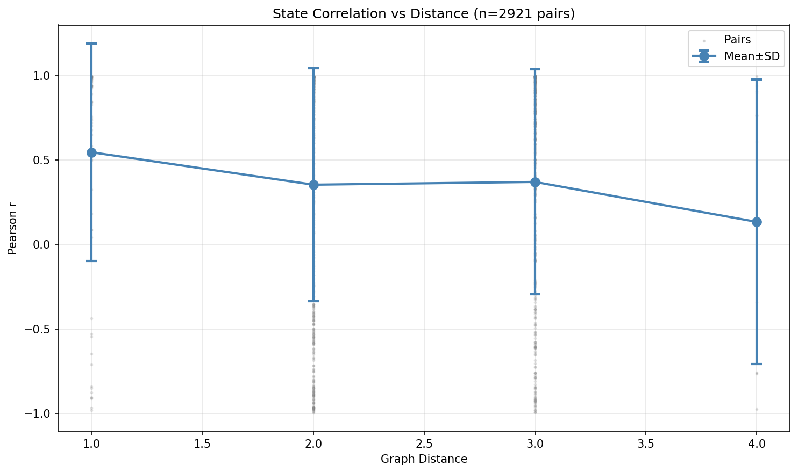

**Figure 12** | State correlation vs graph distance. Blue error bars show mean ± SD for each distance level. Gray points show individual pair samples.

The state correlation decreases with increasing graph distance. Directly connected neurons (dist=1) show mean r = 0.55 (SD = 0.65), while neurons at distance 4 show mean r = 0.13 (SD = 0.84). The large standard deviations (exceeding the means) indicate a highly skewed distribution. A boxplot or histogram would better capture this multimodality, but the error bars shown in Figure 12 nevertheless reveal the clear decreasing trend with distance. This reflects the high-dimensional, distributed nature of neural coding in the reservoir: even nearby neurons can exhibit diverse, complementary dynamics rather than simply mirroring each other's activity. This decay pattern confirms that **information propagation follows network topology**—signals attenuate as they traverse multiple synaptic steps, consistent with the fading memory property of reservoir networks.

### 3.12 Spectral Radius and Echo State Property

The echo state property (ESP) requires that the reservoir's state be uniquely determined by the input history, independent of the initial state. We tested this using a standard (non-leaky) ESN (α=1.0) to observe divergence more clearly, since leaky integration dampens dynamics. Two reservoir copies with different random initial states were driven by the same input for 500 steps. The final Euclidean distance between their trajectories was measured for spectral radii ρ ∈ {0.3, 0.5, 0.7, 0.9, 0.99, 1.5, 2.0, 3.0}.

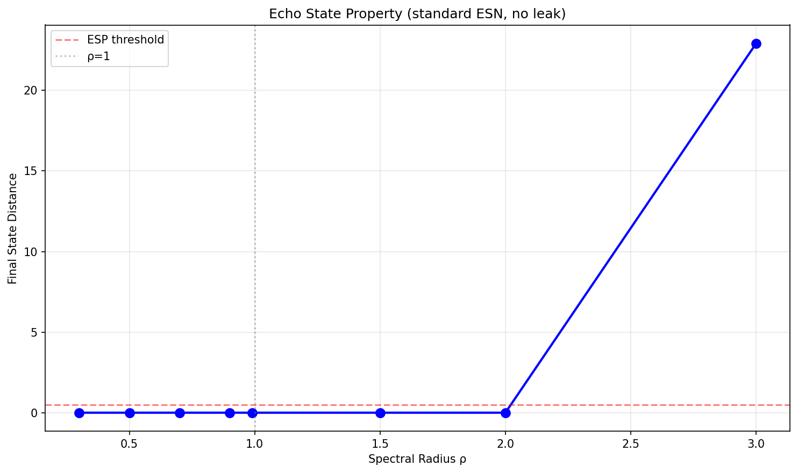

**Figure 13** | Echo state property test using a standard (non-leaky) ESN. Two copies with different initial states are driven by the same random input. Final state distance after 500 steps is plotted against ρ. The red dashed line marks the ESP threshold (dist < 0.5). The gray line marks ρ = 1.

For ρ ≤ 2.0, the two trajectories converge (final distance → 0), confirming that the ESP holds well beyond the classical Jaeger condition of ρ < 1. At ρ = 3.0, the final distance jumps to ≈ 23, indicating divergence and loss of the ESP. This extended stability is due to **tanh saturation**: even when the linearized dynamics near the origin are unstable (ρ > 1), tanh bounds the state to [−1, 1], preventing unbounded growth. For the leaky ESN (α = 0.3) used in our main experiments, the damping from the leak term further stabilizes the dynamics.

### 3.13 State Space Visualization

We visualized the reservoir's high-dimensional (283-D) state space using PCA and t-SNE dimensionality reduction. Three input conditions were tested: (1) sine wave input (periodic), (2) random noise input (stochastic), and (3) step pulse input (transient). We also compared state space trajectories under different spectral radii.

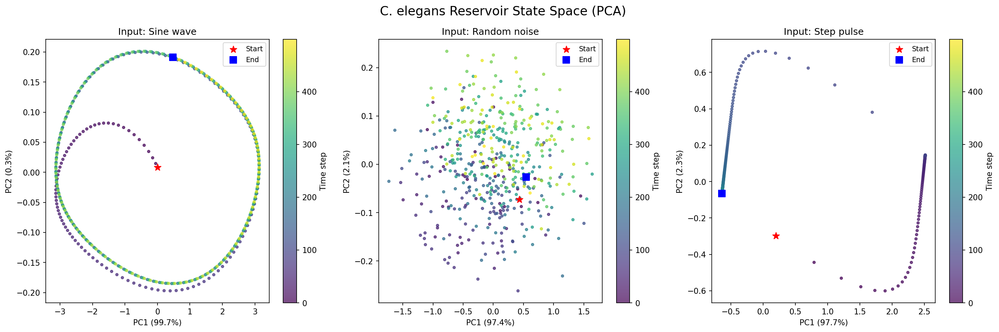

**Figure 14** | PCA of reservoir states under three input conditions. Color encodes time step (dark→light: early→late). Red stars mark the initial state; blue squares mark the final state.

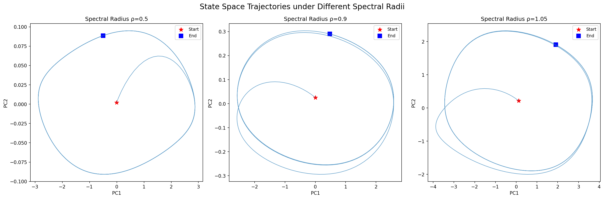

**Figure 15** | PCA trajectories under different spectral radii. ρ=0.5 (left): rapid convergence, limited trajectory extent. ρ=0.9 (center): rich dynamics with extended exploration of state space. ρ=1.05 (right): slightly larger trajectory envelope.

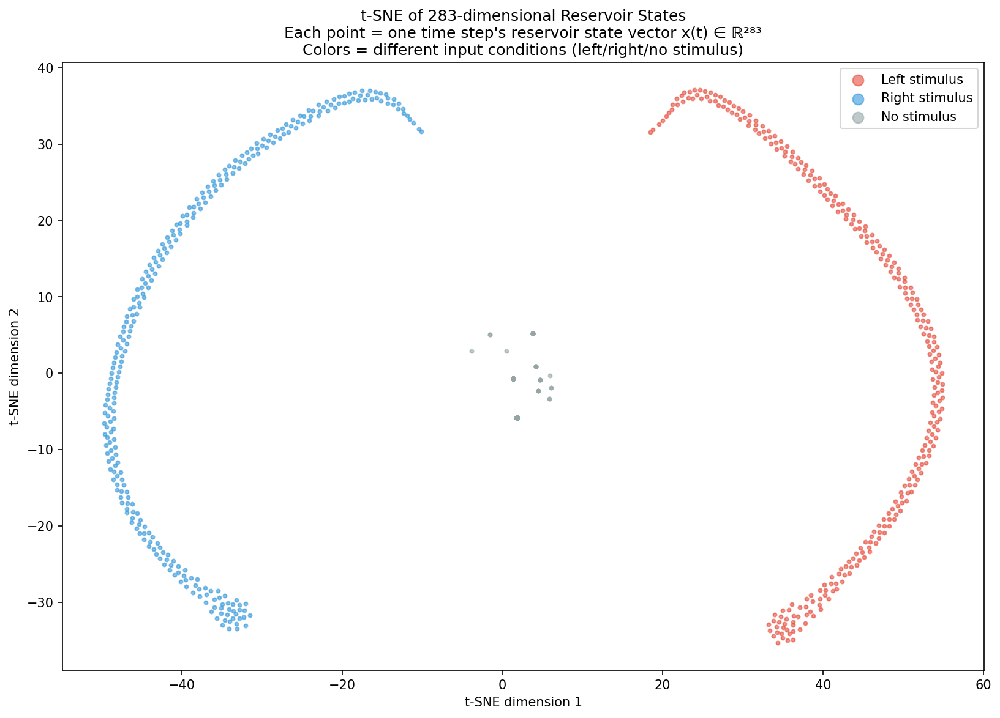

**Figure 16** | t-SNE of 283-D reservoir states under left stimulus (red), right stimulus (blue), and no stimulus (gray) conditions. Each point represents the full reservoir state vector at one time step.

Under sine wave input (Figure 14, left), the reservoir states form regular periodic orbits in PC space, reflecting the periodic driving. Under random noise (center), the states perform a random walk, exploring a broad region of state space. Under step pulse input (right), the state jumps from the initial attractor to a new attractor corresponding to the sustained input.

When varying the spectral radius (Figure 15), ρ=0.5 produces strongly contracted trajectories with limited state space coverage, corresponding to short memory. ρ=0.9 yields rich, extended trajectories that explore the state space widely—this is the regime typically preferred for reservoir computing. ρ=1.05 produces slightly larger envelopes but not dramatically different, consistent with the ESP analysis above showing that tanh saturation prevents unbounded divergence.

The t-SNE visualization (Figure 16) projects the 283-dimensional reservoir state vectors to 2D. The three input conditions form **clearly separated clusters** along the horizontal axis: left stimulus (red) occupies the far right, right stimulus (blue) occupies the far left, and no stimulus (gray) occupies the center. This demonstrates that the connectome-based reservoir encodes different input conditions into distinct regions of its high-dimensional state space—a prerequisite for reliable decoding. The near-chance accuracy of the simple mean-comparison readout used in our 2AFC task (§3.6) therefore reflects the **insufficiency of the readout strategy**, not a lack of separable information in the reservoir states.

### 3.14 Topology-Performance Correlation

To examine whether specific network topological features predict computational performance, we generated 16 network instances (1 real connectome + 5 degree-preserving randomized + 5 ER + 5 WS) and computed their topological metrics and Lorenz prediction MSE. Pearson correlations were computed between each topological metric and performance.

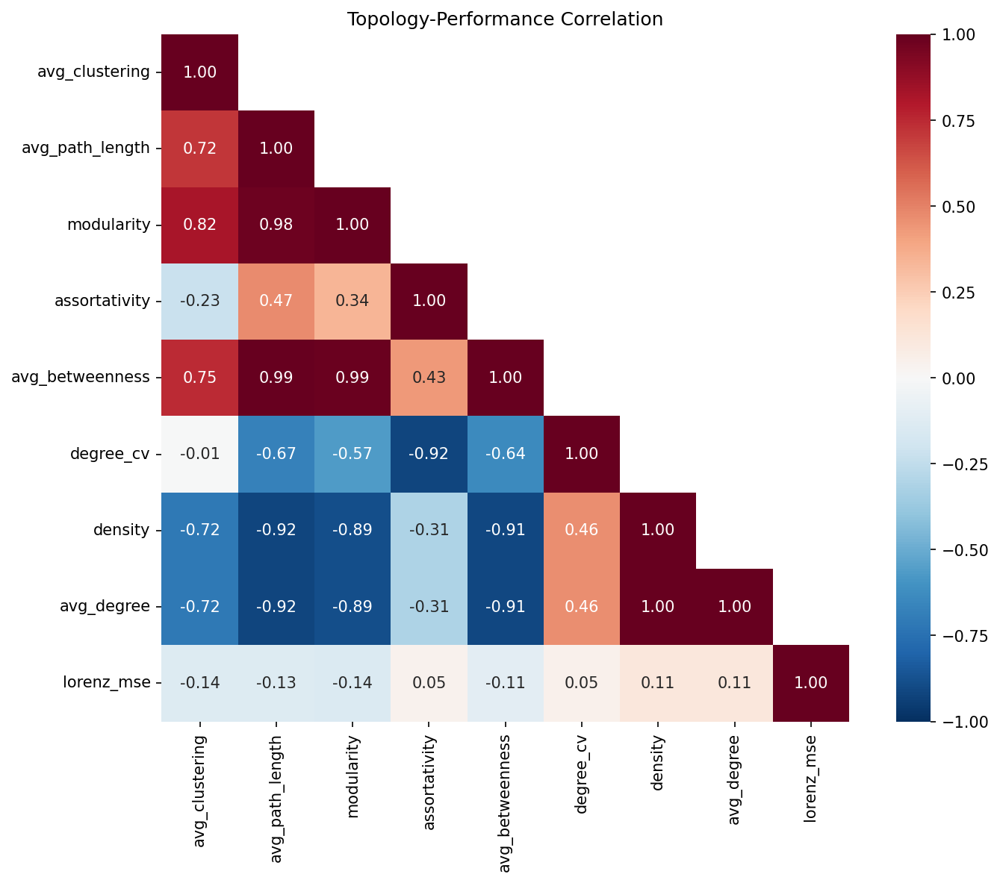

**Figure 17** | Topology-performance correlation matrix. Values show Pearson r between each pair of variables. No significant correlations with Lorenz MSE are observed.

All topological metrics—clustering coefficient, path length, modularity, assortativity, betweenness centrality, degree heterogeneity, density, and average degree—show weak and statistically non-significant correlations with Lorenz MSE (all p > 0.05). This result reinforces the conclusion from the null model comparison: for simple regression tasks, **the specific topology of the connectome is not a significant predictor of computational performance**. Reservoir computation power appears to depend more on macroscopic properties (dimensionality, recurrence strength, nonlinearity) than on the precise wiring pattern.---

## 4. Discussion

### 4.1 Summary of Findings

| Question | Answer |
|:---|:---|
| Small-world? | ✅ Yes (σ=2.11, p<0.001) |
| Scale-free? | ❌ No (r²=0.033) |
| Reservoir core? | 99.6% of neurons |
| Outperforms random? | ❌ Not on simple tasks |
| E/I effect? | ⚠️ Negligible |
| Lesion vulnerability? | Distributed, no single point of failure |
| Topology → Performance? | No significant correlation |

### 4.2 Interpretation

The *C. elegans* connectome is undoubtedly a structurally optimized network—it exhibits significant small-world properties, high modularity, and efficient information routing. However, on the simple linear regression tasks tested, the real connectome does not outperform random networks. This negative result is informative: **structural advantages likely manifest in tasks requiring specific information routing or biologically relevant behaviors** rather than generic function approximation. The near-chance 2AFC performance aligns with cognitive decision model theory—decision-making requires specific recurrent circuit architectures that may not be present in the raw connectome without task-specific readout training.

### 4.3 Limitations

1. Ridge regression only; FORCE learning might reveal different patterns.
2. Random W_in rather than biologically grounded input connections.
3. Deterministic dynamics without intrinsic neural noise.
4. E/I balance tested only as global ratio.

### 4.4 Future Directions

- Biologically relevant tasks (thermotaxis behavior simulation)
- Working memory (delayed match-to-sample)
- Larger connectomes (*Drosophila*, mouse)
- Multi-compartment models with community-specific dynamics
- Plasticity mechanisms (Hebbian learning)

---

## 5. References

1. Casal Santiago MÁ (2018) Bachelor Thesis, UPF.
2. Galella Toledo S (2018) Bachelor Thesis, UPF.
3. Jaeger H (2001) The echo state approach. *GMD Report* 148.
4. Lukoševičius M (2012) A practical guide. *Neural Networks: Tricks of the Trade*.
5. Maass W, Natschläger T, Markram H (2002) *Neural Computation* 14(11).
6. Sussillo D, Abbott LF (2009) *Neuron* 63(4).
7. Varshney LR, et al. (2011) *PLoS Comput Biol* 7(2).
8. Vreeswijk C, Sompolinsky H (1996) *Science* 274.
9. Watts DJ, Strogatz SH (1998) *Nature* 393.
10. White JG, et al. (1986) *Phil Trans R Soc Lond B* 314.
